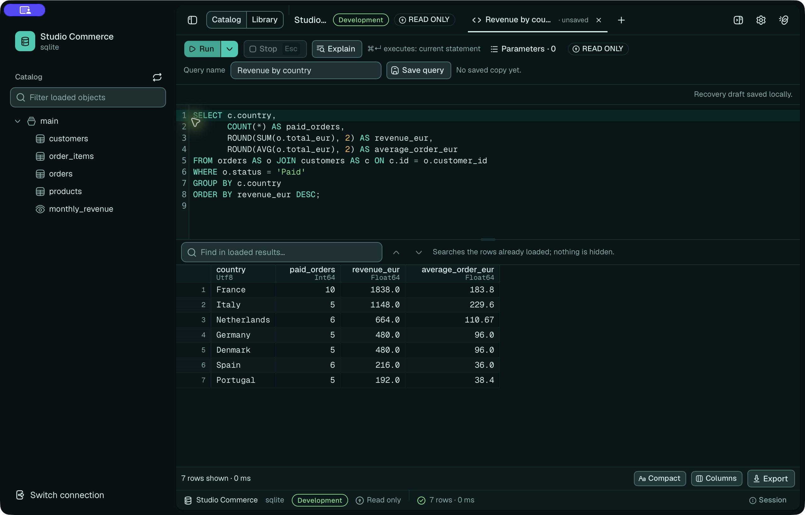
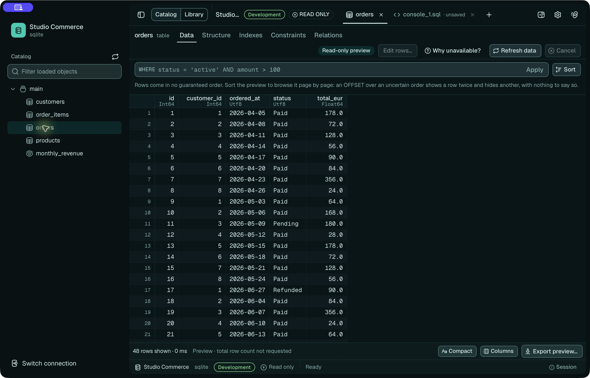
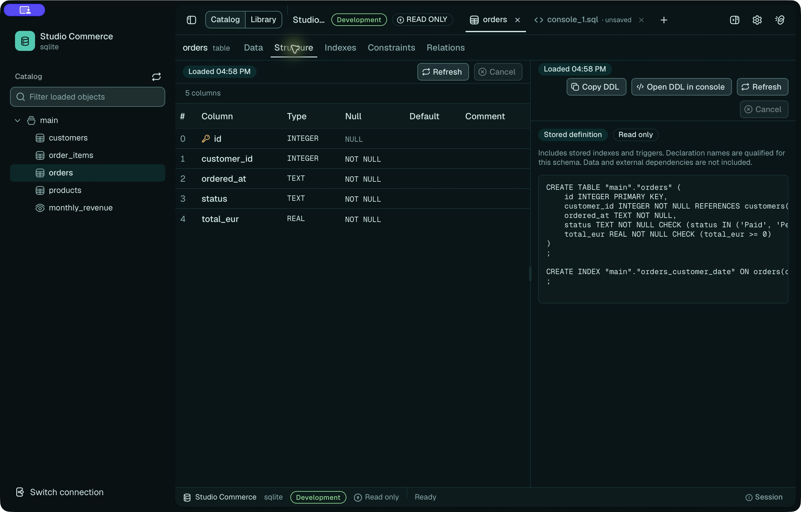

<!-- oxyn-translation source="assets/demo/README.md" sha256="22c53462fe1a" -->

> Traduction française de [assets/demo/README.md](../../../../assets/demo/README.md). **La version anglaise fait foi.**

# Galerie de l’interface et démonstrations

Captures natives macOS enregistrées le 2026-10-03 avec **Oxyn 0.0.3**, un
workspace temporaire et le jeu SQLite fictif de
[seed.sql](../../../../assets/demo/seed.sql). Les noms d’entreprises, les commandes
et le chiffre d’affaires sont fictifs. Aucune base externe ni aucun fournisseur
IA n’intervient.

## Captures

### Console SQL

Une requête de chiffre d’affaires joint les clients et les commandes payées,
regroupe par pays et affiche les résultats dans la grille. La requête exacte
figure dans [revenue.sql](../../../../assets/demo/revenue.sql).



### Exploration des tables

Le catalogue et l’onglet Data affichent les commandes de démonstration.



### Inspection du schéma

L’onglet Structure affiche les colonnes lues dans le catalogue SQLite.



## Vidéos

| Démonstration | Durée | Lecture | Contenu |
|---|---|---|---|
| Explorer une base | 31 s | [MP4](../../../../assets/demo/videos/explore-database.mp4) | Ouvrir les commandes, parcourir les données, inspecter Structure, DDL et Indexes. |
| Exécuter une requête de chiffre d’affaires | 21 s | [MP4](../../../../assets/demo/videos/run-query.mp4) | Saisir le SQL, l’exécuter explicitement et inspecter la grille de résultats. |

Les vidéos sont des enregistrements d’écran H.264 sans son (1920 × 1286, 30 images/s).
Les pauses ont été raccourcies ; les interactions et les résultats sont réels.
Les captures conservent leurs 2560 × 1640 pixels d’origine. Téléchargez les liens MP4
si votre lecteur Markdown ne propose pas de lecture. Ces captures illustrent
ces parcours locaux précis ; elles ne valident pas les autres drivers ni l’IA.

## Démonstrations animées

Une courte vidéo par fonctionnalité, plus une vue d’ensemble qui enchaîne
l’essentiel. Ce **ne sont pas des enregistrements d’écran** : l’interface est
reconstruite à partir des mêmes primitives shadcn sur Base UI, des mêmes jetons
OKLCH et des mêmes polices que l’application, puis animée image par image avec
Remotion. Elles suivent Oxyn 0.0.8 et le jeu de
[seed.sql](../../../../assets/demo/seed.sql), mais certains libellés, questions et
réponses de l’IA ont été écrits pour les vidéos ; les enregistrements ci-dessus
restent la référence de ce que l’application affiche réellement.

| Démonstration | Durée | Lecture | Contenu |
|---|---|---|---|
| Vue d’ensemble | 46 s | [MP4](../../../../assets/demo/videos/motion/overview.mp4) | Exploration, requête et garde-fous, enchaînés. |
| Intro | 4 s | [MP4](../../../../assets/demo/videos/motion/intro.mp4) | Le symbole, le nom, la promesse. |
| Connexions | 16 s | [MP4](../../../../assets/demo/videos/motion/connections.mp4) | Choix du moteur, formulaire, environnement, test, ouverture du workspace. |
| Explorer une base | 11 s | [MP4](../../../../assets/demo/videos/motion/explore-database.mp4) | Le catalogue se déplie, `orders` s’ouvre, puis sa structure et son DDL. |
| Relations | 16 s | [MP4](../../../../assets/demo/videos/motion/relations.mp4) | Index, contraintes, relations entrantes et sortantes, diagramme ER. |
| Exécuter une requête | 14 s | [MP4](../../../../assets/demo/videos/motion/run-query.mp4) | La requête de chiffre d’affaires se tape, ⌘↵, les lignes arrivent, la requête est sauvegardée. |
| Outils de résultat | 16 s | [MP4](../../../../assets/demo/videos/motion/result-tools.mp4) | Recherche dans les lignes chargées, colonnes, densité, inspection d’une valeur, export. |
| Graphiques | 15 s | [MP4](../../../../assets/demo/videos/motion/charts.mp4) | Un résultat devient un graphique, dans les seules formes que les données permettent. |
| Bibliothèque | 15 s | [MP4](../../../../assets/demo/videos/motion/library.mp4) | Requêtes sauvegardées, brouillons modifiés, résultats conservés. |
| Palette de commandes | 14 s | [MP4](../../../../assets/demo/videos/motion/command-palette.mp4) | Palette ⌘K, ouverture rapide ⌘P, feuille des raccourcis ⌘/. |
| Opérations sur les objets | 16 s | [MP4](../../../../assets/demo/videos/motion/object-operations.mp4) | Rename… et Drop… passent par une boîte de revue ; le nom se tape en production. |
| Garde-fous | 15 s | [MP4](../../../../assets/demo/videos/motion/guardrails.mp4) | Repères permanents, dialogue natif d’écriture en production, proposition d’agent laissée en texte. |
| Assistant | 19 s | [MP4](../../../../assets/demo/videos/motion/assistant.mp4) | Mention d’objet, plan, appels d’outils, un échantillon et sa confirmation native, sources. |
| Confidentialité IA | 16 s | [MP4](../../../../assets/demo/videos/motion/ai-privacy.mp4) | Fournisseurs locaux et distants, niveaux de confidentialité par connexion. |
| Reprise | 15 s | [MP4](../../../../assets/demo/videos/motion/recovery.mp4) | Sortie avec une transaction ouverte, brouillons restaurés après un arrêt brutal. |
| Fermeture | 4 s | [MP4](../../../../assets/demo/videos/motion/outro.mp4) | La signature et l’adresse du dépôt. |

H.264, 1920 × 1080, 30 images/s, sous-titres en anglais, avec une bande son :
« The Inner Space » d’Art Flower via Free Music Archive et des effets sonores
d’interface issus de Freesound, de Kenney et de la bibliothèque Remotion, tous
sous CC0 1.0.

## Provenance des captures

L’application installée n’est pas une compilation vérifiée de ce checkout.
L’exécutable installé d’origine a pour SHA-256
`1d85505c37e9daceb4c845458602057ab6fbbeac8785fb6e4f48b4f0292e1d99`.

Pour isoler les captures, une copie jetable de l’application installée utilisait
un identifiant de bundle distinct et une signature locale ad hoc. Le code et les
ressources web étaient inchangés ; l’empreinte ci-dessus désigne l’exécutable
avant cette nouvelle signature.

## Reproduire les scènes

Depuis la racine du dépôt, créez une base jetable neuve :

```sh
demo_dir=$(mktemp -d /tmp/oxyn-demo.XXXXXX)
sqlite3 "$demo_dir/studio.sqlite" < assets/demo/seed.sql
printf '%s\n' "$demo_dir/studio.sqlite"
open -n /Applications/Oxyn.app --args --temporary-workspace
```

Ces enregistrements utilisent l’application macOS installée. Pour essayer le même
parcours avec les sources du checkout, utilisez plutôt `make desktop-dev`.

Dans l’application temporaire :

1. Créez une connexion SQLite nommée **Studio Commerce** avec le chemin affiché.
   Choisissez l’environnement **Development** et activez la lecture seule.
2. Connectez-vous, développez le catalogue et ouvrez **orders**. Capturez les
   onglets **Data** et **Structure** ; incluez **DDL** dans la vidéo d’exploration.
3. Ouvrez une console SQL, saisissez [revenue.sql](../../../../assets/demo/revenue.sql),
   sélectionnez explicitement le SQL, puis cliquez sur **Run**. Capturez l’éditeur et les résultats terminés.

Capturez uniquement la fenêtre de démonstration. Excluez les autres fenêtres,
notifications, chemins personnels et identifiants du cadre. N’enregistrez pas
un workspace existant. Conservez les pixels d’origine pour les captures et
encodez les vidéos en MP4 H.264 sans piste audio. Vérifiez visuellement le
résultat avant de remplacer ces fichiers. La base et les enregistrements bruts
restent des fichiers de travail locaux, hors des ressources du dépôt.
